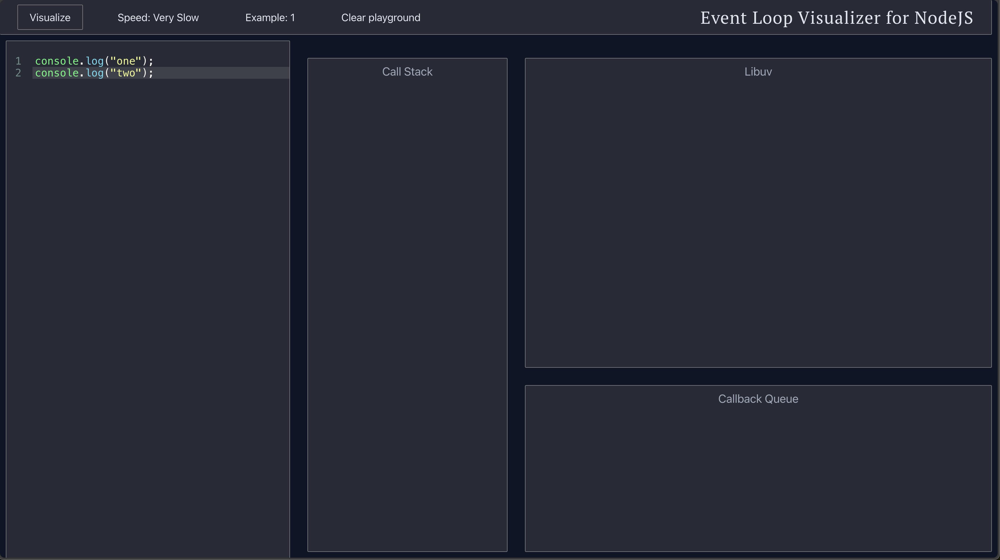

## Event Loop Visualizer in Node

### User Interface

### Run the app
1. You need to install the dependencies first, make sure you are in the right path first: `npm install`
2. You can start the server: `npm start`

### How to use it?
Write ES5 code on the editor. 
Click **Visualize** button on the top left corner to visualize your code. 

### Acknowledgment
This project was created from the public [repository](https://kamronbekshodmonov.github.io/JELoop-Visualizer).